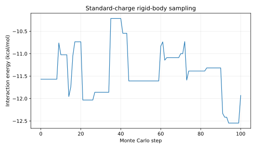

# Q-pMHC

[](https://www.python.org/)
[](LICENSE)

## Motivation

Does a quantum-derived peptide charge distribution change the modeled peptide–MHC electrostatic interaction relative to fixed, simplified classical charges?

## Abstract

Q-pMHC is a didactic rigid-body Metropolis Monte Carlo sampler for a peptide–MHC complex (HLA-A*0201, PDB 1DUZ). It compares a toy classical charge table with QM-derived peptide charges: gas-phase, unembedded PySCF Hartree–Fock Mulliken charges. It reports an interaction energy under a toy potential (distance-dependent Coulomb plus a generic Lennard–Jones term). This energy is not a binding free energy. It is a learning project inspired by PELE, not a production tool.

## Repository layout

```text
NeoBind_lite/
|-- data/
|   `-- raw/
|       |-- .gitkeep
|       `-- 1DUZ.pdb
|-- src/
|   `-- qpmhc/
|       |-- __init__.py
|       `-- core.py
|-- scripts/
|   `-- plot_energy_trace.py
|-- results/
|   `-- standard_mc_trace.svg
|-- tests/
|   `-- test_core.py
|-- .gitignore
|-- environment.yml
|-- pyproject.toml
|-- LICENSE
`-- README.md
```

The supplied [RCSB PDB entry 1DUZ](https://www.rcsb.org/structure/1DUZ) is a 1.8 Å HLA-A*0201 structure with the nonameric HTLV-1 Tax peptide LLFGYPVYV (chain C; the PDB header also calls it "octameric"). Cite the primary study: Khan et al., “The structure and stability of an HLA-A*0201/octameric Tax peptide complex with an empty conserved peptide-N-terminal binding site,” *Journal of Immunology* 164(12), 6398–6405 (2000), [doi:10.4049/jimmunol.164.12.6398](https://doi.org/10.4049/jimmunol.164.12.6398). The paper is the primary citation associated with both 1DUY and 1DUZ.

## Quickstart

The supplied crystal structure has no hydrogen atoms. This standard-mode run uses the included heavy-atom coordinates:

```bash
conda env create -f environment.yml
conda activate qpmhc-env
pip install -e .
qpmhc data/raw/1DUZ.pdb --mode standard --steps 100
```

The console command and `python -m qpmhc.core` accept the same arguments. By default, the workflow uses receptor chain A and peptide chain C, runs 2,000 steps at 300 K, and seeds the sampler with 42. Pass `--steps` and `--seed` to set these explicitly.

### Comparing standard and QM charges

QM mode needs peptide hydrogens. For a fair charge comparison, prepare the structure once in each run using the same hydrogen-addition procedure and sampling settings:

```bash
conda install -c conda-forge openmm pdbfixer
qpmhc data/raw/1DUZ.pdb --mode standard --add-hydrogens --steps 100 --seed 42
qpmhc data/raw/1DUZ.pdb --mode qm --add-hydrogens --steps 100 --seed 42
```

PDBFixer requires OpenMM; the install command follows the [PDBFixer manual](https://github.com/openmm/pdbfixer/blob/master/Manual.html) and [OpenMM installation guide](https://docs.openmm.org/latest/userguide/application/01_getting_started.html). These are optional dependencies and are not in the base environment. QM mode calculates gas-phase HF/3-21G Mulliken charges for the peptide only, without electrostatic embedding; the receptor retains the toy classical charges. Mulliken charges are basis-set dependent and are not ESP-fitted charges.

## Results

With the supplied heavy-atom PDB, standard mode, 100 steps, and seed 42, the mean interaction energy after burn-in was **−11.46 ± 0.60 kcal/mol**, with a **24.0% acceptance rate**. The trace below is a diagnostic of the sampler on a toy potential.



Regenerate the figure with:

```bash
pip install -e ".[plots]"
python scripts/plot_energy_trace.py data/raw/1DUZ.pdb --steps 100 --seed 42 --output results/standard_mc_trace.svg
```

## Interaction model

For each peptide–receptor pair, the distance is floored at $r^*_{ij}=\max(r_{ij},1\ \text{Å})$. The distance-dependent dielectric is $\epsilon(r)=4r$, giving:

$$
E_{\mathrm{Coul}} = 332.06371\sum_{i\in P}\sum_{j\in R}
\frac{q_iq_j}{4(r^*_{ij})^2}
\quad \mathrm{kcal\ mol^{-1}}.
$$

The generic Lennard–Jones term uses $\sigma=3.0\ \text{Å}$ and $\epsilon=0.1\ \mathrm{kcal\ mol^{-1}}$:

$$
E_{\mathrm{LJ}} = \sum_{i\in P}\sum_{j\in R}4\epsilon
\left[\left(\frac{\sigma}{r^*_{ij}}\right)^{12}
-\left(\frac{\sigma}{r^*_{ij}}\right)^6\right].
$$

Rigid-body trial moves use the Metropolis criterion:

$$
P_{\mathrm{accept}} = \min\left(1,\exp\left[-\frac{\Delta E}{k_{\mathrm B}T}\right]\right),
\qquad k_{\mathrm B}=0.0019872042\ \mathrm{kcal\ mol^{-1}\ K^{-1}}.
$$

## Scope and reproducibility

The classical charge table is a small AMBER-like approximation, not a complete force field; Lennard–Jones parameters are identical for every atom pair. The table is **not charge-neutral**: for the heavy-atom 1DUZ peptide (formal charge 0) the toy charges sum to −3.489 e, because each residue's backbone N/CA/C/O sums to −0.388 e and the termini are uncharged. Mulliken charges always sum to the molecule's net charge, so standard and QM mode currently compare peptides with different total charge. Sampling changes only rigid-body translation and rotation. Starting from a crystal pose, most moves raise this toy potential, so the run mainly probes local potential stiffness and acceptance behavior. The reported interaction energy omits desolvation, entropy, and protein reorganization and must not be interpreted as a binding free energy.

The Conda environment specifies Python 3.10 and the runtime/test dependencies. The CLI defaults to seed 42; the figure command records its step count and seed. Run tests from the repository root with:

```bash
pytest
```

## AI assistance

The code and documentation in this repository were written with AI assistance (Claude Code) and reviewed by the author.
